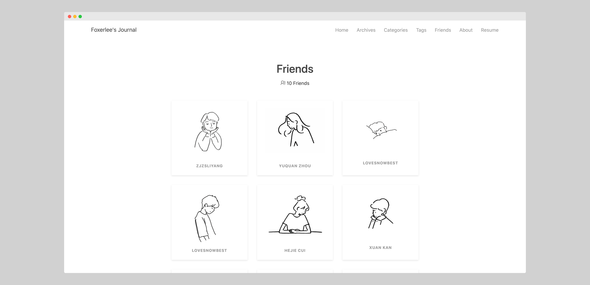
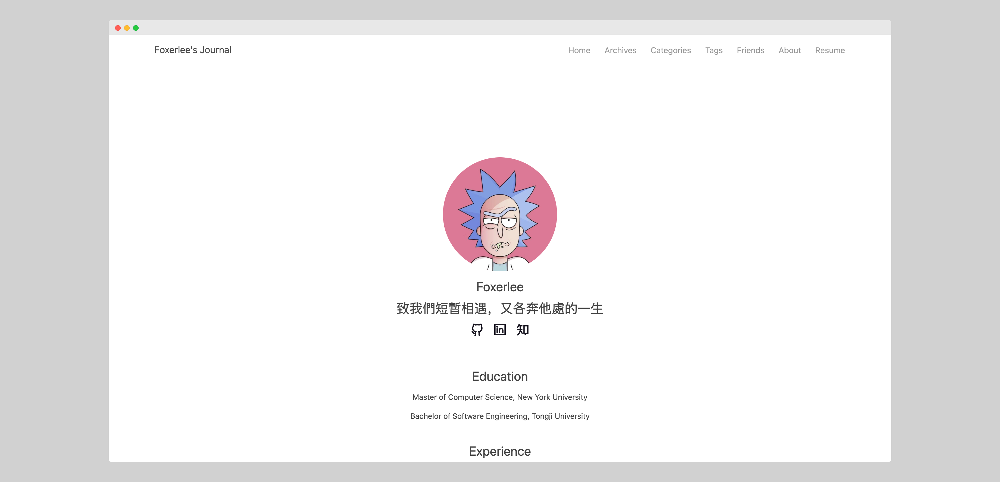

# Terran
[](https://github.com/FoxerLee)      

A Light, Concise and Powerful Hexo's theme: Terran.

## Theme Preview

### Preview photos





<details>
<summary><mark>More</mark></summary>



</details>


### Preview site

- Foxerlee's Journal: https://www.foxerlee.top/

## Theme features

- [x] Article word count, reading time
- [x] Card's friends page
- [x] Image lazy loading
- [ ] Site search
- [ ] Number of visitors
- [x] Code highlight
- [x] Mobile support 
- [x] Comment support

......

## Usage

### Installation

1. Download main code

```bash
git clone https://github.com/FoxerLee/hexo-theme-terran.git themes/terran
```

2. Install required extension

```bash
npm i --save hexo-wordcount
```

### Setting

Change configuartion file: `_config.yml`

```yaml
# Change to
theme: terran
```

### Update

```bash
cd themes/terran
git pull origin master
```

This theme supports dynamic updates without replacing the original theme configuration file. The way to use it: Create a `temp.yml` file in `source/_data/`, which is equivalent to the theme's `_config.yml` file, and has a higher priority. It will not be changed after `git pull`, so if you want to update the theme frequently, please use this way to set configuartion file.

## Configuartion

``` yaml
# Blog's name
headername: Foxerlee's Journal

# Menu bar
menu:
  Home: /
  Archive: /archives
  Categories: /category
  Tags: /tag
  Friends: /friends
  About: /about

# Main page
## Title in main page
profile_title: Foxerlee's Journal

links:
  # douban: /#
  # bilibili: /#
  github: https://github.com/FoxerLee
  linkedin: https://www.linkedin.com/in/yuan-li-008b3b142/
  zhihu: https://www.zhihu.com/people/foxerlee/activities
  facebook: /#
  twitter: /#
  # weibo: /#
  # reddit: /#
  # stack-overflow: /#
  # gitlab: /#
  # pinterest: /#
  # youtube: /#

# Start year of this website
start_year: 2017

# friend links
## image can be found in source/images/，you can change to your own images
friends:
  1:
    name: Test
    url: http://www.foxerlee.top/
    image: /images/a1.jpg
  2:
    name: Test
    url: http://www.zjzsliyang.com/
    image: /images/a2.jpg
  3:
    name: Test
    url: http://www.zjzsliyang.com/
    image: /images/a3.jpg
  4:
    name: Test
    url: http://www.zjzsliyang.com/
    image: /images/a4.jpg
## number of friend links
friends_length: 4

# format of time
## reference: http://momentjs.com/docs/#/displaying/format/
date:
  month: MMM, YYYY
  day: MMM DD, YYYY

# Copyright of each post
##
copyright: true
## Add current post's url
permalink: true
## License
license: Copyright (c) <a href="http://creativecommons.org/licenses/by-nc/4.0/">CC-BY-NC-4.0</a> LICENSE
## Signature
signature: stay hungry, stay foolish


# Word cound
# required extension: https://github.com/willin/hexo-wordcount
post_wordcount:
  wordcount: true         # single page, word count
  min2read: true          # single page, time to read


stylesheets:
- /css/style.css


scripts:
- /js/hexo-theme-terran.js
- /js/md5.js
- /js/lazyLoad.js

gitalk:
  enable: true
  ClientID: # Client ID
  ClientSecret:  # Client Secret
  repo:  # repo which stores your blog
  owner: FoxerLee # Github account name
  adminUser: ['FoxerLee']
  ID: location.pathname
  labels: ['Gitalk'] # GitHub issues' tag
  perPage: 10 # How many comments in per page
  pagerDirection: last # first - old to new; last - new to old
  createIssueManually: false # if need admin user to create issue
  distractionFreeMode: false # if cmd|ctrl + enter can submit comment

# About page
## github_chart is from https://github.com/2016rshah/githubchart-api 
about:
  avatar: /images/avatar.jpeg
  name: Foxerlee
  signature: 致我們短暫相遇，又各奔他處的一生
  education:
    1: Master of Computer Science, New York University
    2: Bachelor of Software Engineering, Tongji University
  experience:
    1: Software Develop Intern, Amazon
    2: Graduate Assistant, New York University
    3: Research Intern, National Instruments
    4: Software Intern, Microsoft
  interest: Machine Learning, Computer Vision, OCR, Segmentation, Few-shot Learning, Cybersecurity, Coding, Reading, Dota2, Fitness
  github_chart: Foxerlee
  
lazyload:
  enable: true
  onlypost: false
  loadingImage: https://cdn.jsdelivr.net/npm/skx@0.0.9/img/lazy.gif
```

## Others

### Thanks

Reference and extensions I used in development:

- Chic: https://github.com/Siricee/hexo-theme-Chic
- purer: https://github.com/fengkx/hexo-theme-purer
- Snippet: https://github.com/shenliyang/hexo-theme-snippet
- githubchart-api（GitHub 贡献）: https://github.com/2016rshah/githubchart-api 
- hexo-wordcount（文章字数统计）: https://github.com/willin/hexo-wordcount
- Pulse（主题基础框架）: https://bootswatch.com/pulse/


    