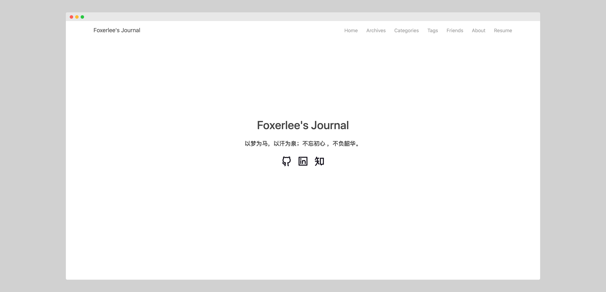

# Terran
[](https://github.com/FoxerLee)      

轻量、简洁的 Hexo 主题：Terran（名字源自：星际争霸，虽然和主题一点无关233）

## 主题预览

### 示意图




<details>
<summary><mark>更多</mark></summary>


</details>


### 预览站点

- Foxerlee's Journal: https://www.foxerlee.top/

## 主题特点

- [x] 文章字数统计，文章阅读时长
- [x] 文章权限
- [x] 个性化友链界面
- [ ] 图片懒加载
- [ ] 站内搜索
- [ ] 访客统计
- [x] 代码高亮
- [x] 移动端适配 
- [ ] 评论系统

......

## 使用方法

### 安装

1. 下载基本代码

```bash
git clone https://github.com/FoxerLee/hexo-theme-terran.git themes/terran
```

2. 安装必要扩展

```bash
npm i --save hexo-wordcount
```

### 设置

修改博客本身的 `_config.yml`

```yaml
# 修改为
theme: terran
```

### 更新

```bash
cd themes/terran
git pull origin master
```

本主题支持动态更新而不需重新替换原始主题配置文件。使用方法为：在 `source/_data/` 中创建 `temp.yml` 文件，该文件与主题的 `_config.yml` 文件等效，且优先级更高，也不会在 `git pull` 之后被更新。如果你希望经常更新主题，建议使用该文件。

## 主题配置

``` yaml
# 博客名，会显示在 header 的左上角
headername: Foxerlee's Journal

# 菜单栏的内容设置，如果不需要可以注释
menu:
  Home: /
  Archive: /archives
  Categories: /category
  Tags: /tag
  Friends: /friends
  About: /about

# 主页内容
## 主页标题
profile_title: Foxerlee's Journal
## 标题下方的链接，不需要可以注释
links:
  # douban: /#
  # bilibili: /#
  github: https://github.com/FoxerLee
  linkedin: https://www.linkedin.com/in/yuan-li-008b3b142/
  zhihu: https://www.zhihu.com/people/foxerlee/activities
  facebook: /#
  twitter: /#
  # weibo: /#
  # reddit: /#
  # stack-overflow: /#
  # gitlab: /#
  # pinterest: /#
  # youtube: /#

# 网站起始年份
start_year: 2017

# 友链
## image 可在 source/images/ 中找到，或者替换成自己的
friends:
  1:
    name: Test
    url: http://www.foxerlee.top/
    image: /images/a1.jpg
  2:
    name: Test
    url: http://www.zjzsliyang.com/
    image: /images/a2.jpg
  3:
    name: Test
    url: http://www.zjzsliyang.com/
    image: /images/a3.jpg
  4:
    name: Test
    url: http://www.zjzsliyang.com/
    image: /images/a4.jpg
## 友链总个数
friends_length: 4

# 日期显示格式
## 更多的可参考 http://momentjs.com/docs/#/displaying/format/
date:
  month: MMM, YYYY
  day: MMM DD, YYYY

# 文章底部内容
## 是否开启
copyright: true
## 是否添加本文网址
permalink: true
## 许可
license: Copyright (c) <a href="http://creativecommons.org/licenses/by-nc/4.0/">CC-BY-NC-4.0</a> LICENSE
## 签名
signature: stay hungry, stay foolish


# 文章内容字数统计
# 开启前需安装包: https://github.com/willin/hexo-wordcount
post_wordcount:
  wordcount: true         # 单篇 字数统计
  min2read: true          # 单篇 阅读时长

# <head> 中需读取的 css 文件
stylesheets:
- /css/style.css

# 需读取的 js 文件
scripts:
- /js/hexo-theme-terran.js
- /js/md5.js
- /js/lazyLoad.js

gitalk:
  enable: true
  ClientID: # Client ID
  ClientSecret:  # Client Secret
  repo:  # repo which stores your blog
  owner: FoxerLee # Github account name
  adminUser: ['FoxerLee']
  ID: location.pathname
  labels: ['Gitalk'] # GitHub issues' tag
  perPage: 10 # How many comments in per page
  pagerDirection: last # first - old to new; last - new to old
  createIssueManually: false # if need admin user to create issue
  distractionFreeMode: false # if cmd|ctrl + enter can submit comment

# 关于界面设置
## 不需要的可以注释
## github_chart 源自 https://github.com/2016rshah/githubchart-api 
about:
  avatar: /images/avatar.jpeg
  name: Foxerlee
  signature: 致我們短暫相遇，又各奔他處的一生
  education:
    1: Master of Computer Science, New York University
    2: Bachelor of Software Engineering, Tongji University
  experience:
    1: Software Develop Intern, Amazon
    2: Graduate Assistant, New York University
    3: Research Intern, National Instruments
    4: Software Intern, Microsoft
  interest: Machine Learning, Computer Vision, OCR, Segmentation, Few-shot Learning, Cybersecurity, Coding, Reading, Dota2, Fitness
  github_chart: Foxerlee
  
lazyload:
  enable: true
  onlypost: false
  loadingImage: https://cdn.jsdelivr.net/npm/skx@0.0.9/img/lazy.gif
```

## 其他

### 感谢

本主题参考的主题，以及使用的第三方库如下：

- Chic: https://github.com/Siricee/hexo-theme-Chic
- purer: https://github.com/fengkx/hexo-theme-purer
- Snippet: https://github.com/shenliyang/hexo-theme-snippet
- githubchart-api（GitHub 贡献）: https://github.com/2016rshah/githubchart-api 
- hexo-wordcount（文章字数统计）: https://github.com/willin/hexo-wordcount
- Pulse（主题基础框架）: https://bootswatch.com/pulse/

### 鼓励


主题宗旨：轻量简洁，开箱即用，如果觉得本主题还不错，欢迎 **[Star](https://github.com/FoxerLee/hexo-theme-terran/stargazers)**，您的支持是我继续更新的动力～
